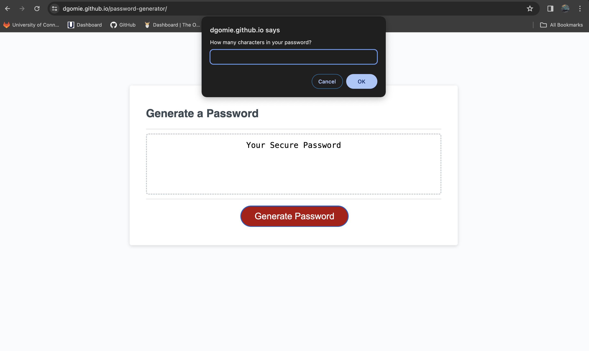
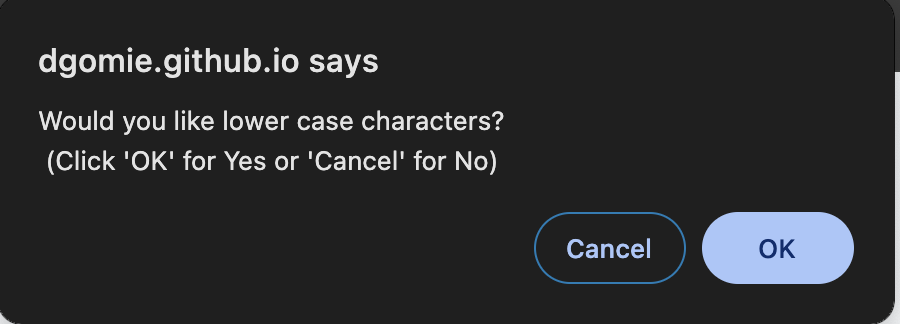
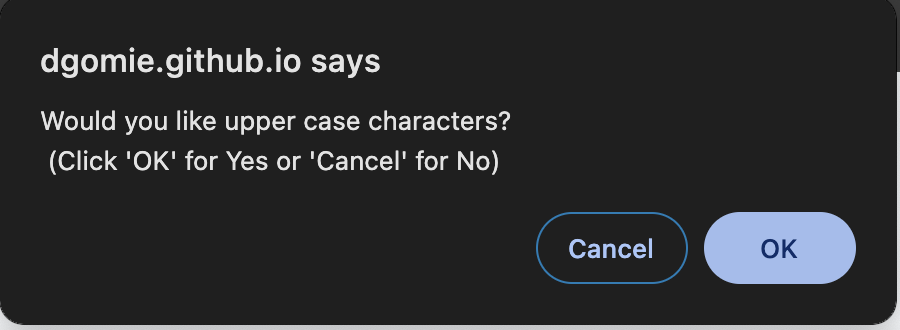
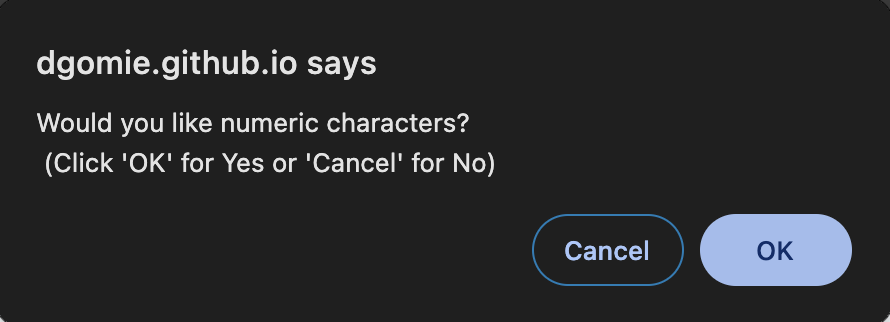
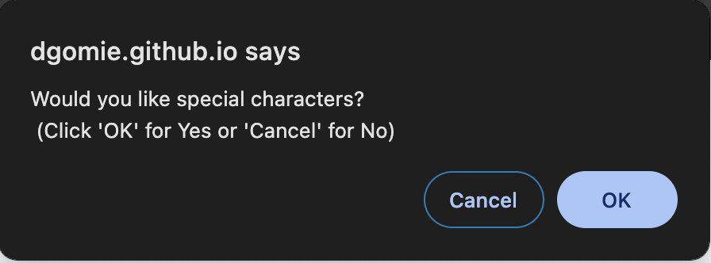
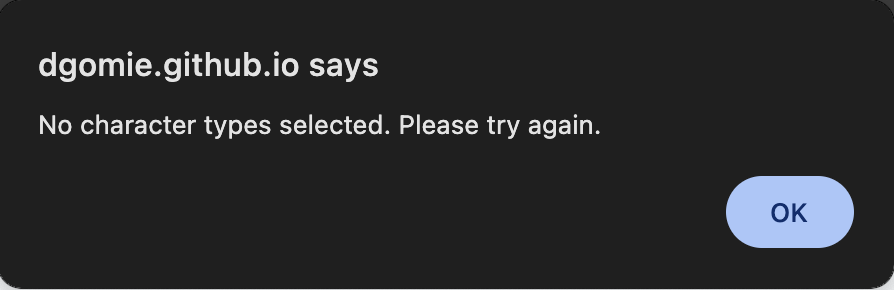
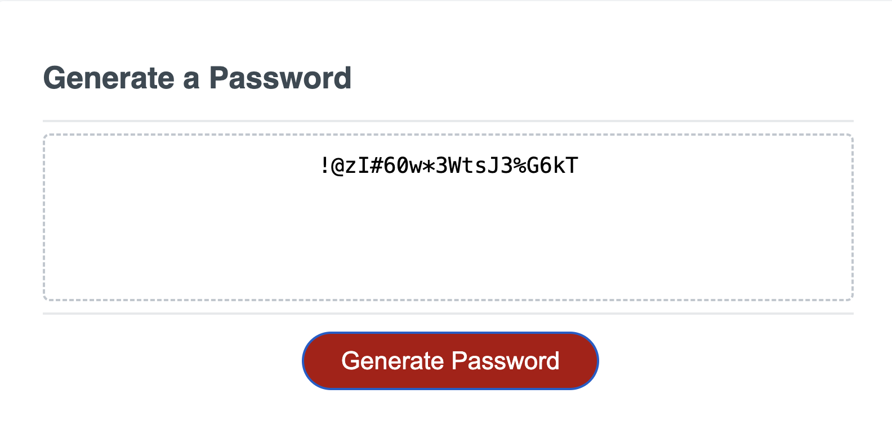

# Password Generator Starter Code

## Description

This project was created to make a password generator that creates strong passwords using alphanumeric and special characters. Since different sites have varying requirements for password complexity, this generator gives the user the ability to choose the length and types of characters needed.

## Installation

N/A

## Usage

Navigate to https://dgomie.github.io/password-generator/. Click the "Generate Password" button to begin generating a new password.

An window prompt will pop up at the top of the screen asking for the amount of characters the user needs in the password. Input a number between 8 and 128. If the user inputs a number outside that range or a character that is not a number, a follow-up prompt will ask the user to try again. Clicking "Cancel" on the prompt will exit the password generator.

After successfully inputing the password length. Four confirmation prompts will pop up asking the user if they require lower case letters, upper case letters, numeric characters, and special characters. The user can confirm their choice by clicking "OK" if they require the specific character and "Cancel" if they do not require the specific character.

If none of the character types are chosen, the user will be notified they haven't selected any character types and asked to try again. Simply click the "Generate Password" to begin again.

Once all the user selects the desired characters needed, the new password will populate within the text box on the main page.

## Credits

Github user [Xandromus](https://github.com/Xandromus): [Starter Code Repo](https://github.com/coding-boot-camp/friendly-parakeet)

Stack Overflow user [Joel Mellon](https://stackoverflow.com/users/430151/joel-mellon): [Shuffle characters in a string](https://stackoverflow.com/questions/3943772/how-do-i-shuffle-the-characters-in-a-string-in-javascript)

## License

Please refer to the LICENSE in the repo.

[def]: "./assets/images/how-many.png"
